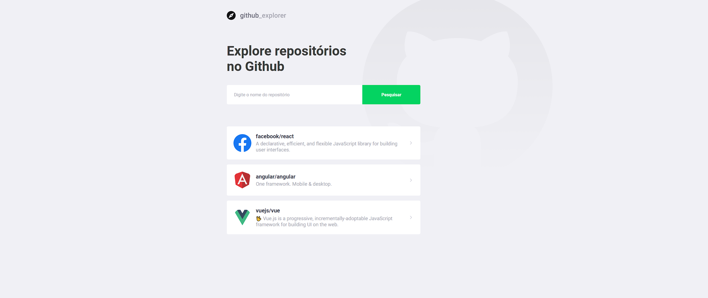

# Github Explorer

Aplicação feita em React e Typescript para pesquisar bibliotecas no Github.
Aplicação feita no modulo do Bootcamp da Rockeseat.

## Tecnologias Usadas

- Axios: Para fazer requisições na Api do github
- Styled Components: para estilização das Páginas
- React-router-dom: para fazer navegação na aplicação
